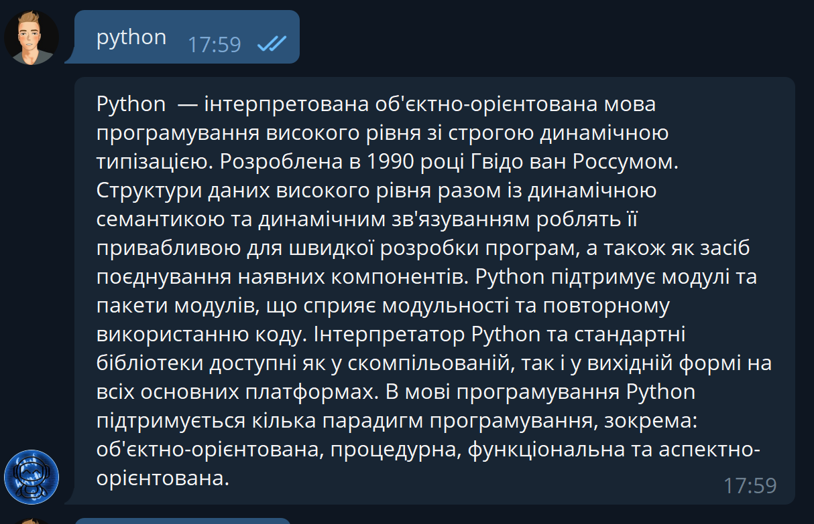
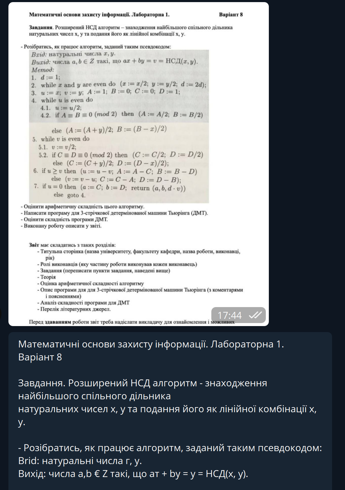
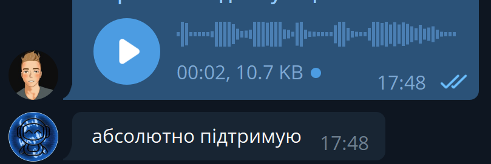
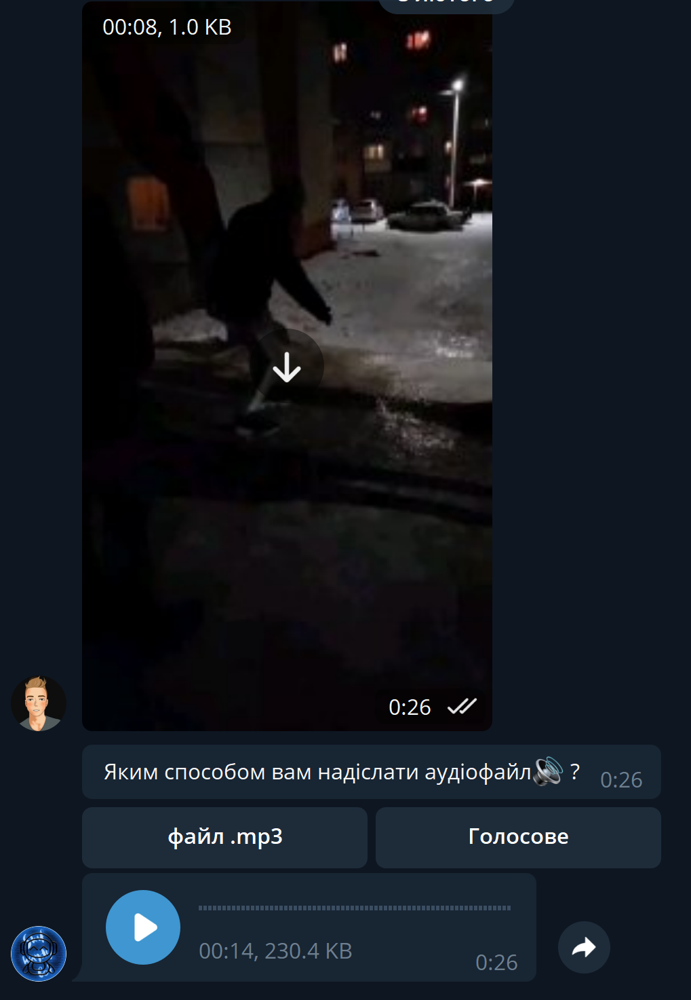
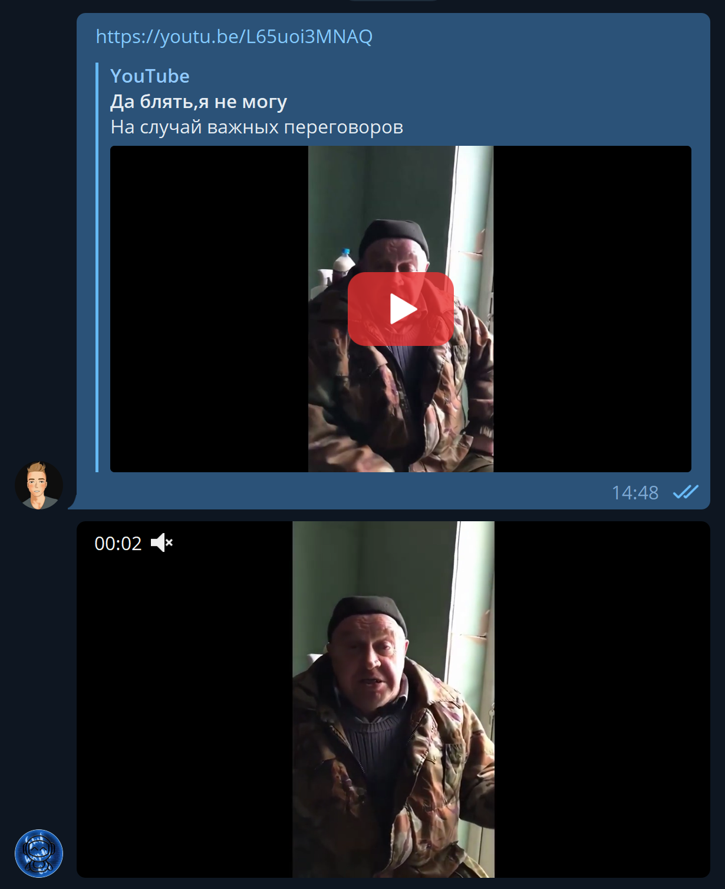

# OmniscientTeleBot

Великий проект телеграм бота який виконує величезну кількість постійних повсякденних функцій

## Функції:
1. Пошук інформації:
Ти пишеш боту любе лово/текст, після чого бот за допомогою модуя pywikipedia знаходить необхіддний термін у вікіпедії, якщо у вікіпедії не має цього терміну то функція переходить до пошуку тексту у вьому гуглі використовуючи selenium

2. Перетворення фото у текст:
Бот приймає прислане користувачем фото та намагається розпізнати у ньому текст за допомогою інструмента "Tesseract-ORC" від Google, функція працює якісно та розпізнає текст різних мов. Бот повертає текст після отриманння зображення

3. Перетворення голосового повідомлення у текст:
Надіслане або переслане голосове повідомлення бот перетворює у текст використовуючи інструмент "ffmpeg", тескт переводить якісно на трьох мовах (українська, російська, англійська)

4. Перетворення відео у звук:
Надіслане відео бот перетворює у звук та надсилає його у вигляді голосового повідомлення або mp3 файла

5. Скачування відео із YouTube:
Надіслану силку бот первіряє чи це ссилка на ютуб, після чого скачує це відео та скидує його вам

Дуже корисний бот який допоможе у повсякденому користуванні, він у телеграмі - @megawiseacre_bot (бот може не працювати через проблеми із хостингом)